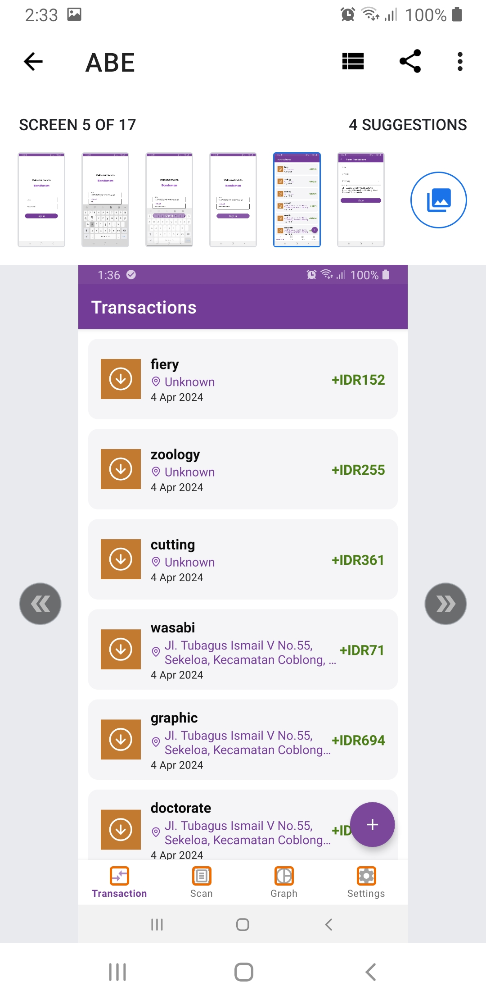

# Bondoman

> Disusun untuk memenuhi Tugas Besar IF3210 Pengembangan Aplikasi pada Platform Khusus
> Tugas Besar 1 - Android

## Deskripsi Aplikasi

**Bondoman** adalah sebuah aplikasi pencatatan transaksi yang dapat digunakan melalui platform Android. Aplikasi menyediakan berbagai fitur berkaitan dengan pencatatan transaksi seperti scan, graph, dan export. Pengguna harus memiliki akun untuk dapat melakukan manajemen transaksi dan memanfaatkan fitur-fitur lainnya.

## Library

Berikut adalah library yang digunakan pada aplikasi
1. AndroidX Core KTX 
2. AndroidX AppCompat 
3. Material Components for Android
4. AndroidX ConstraintLayout
5. AndroidX Lifecycle LiveData KTX
6. AndroidX Lifecycle ViewModel KTX
7. AndroidX Navigation Fragment KTX
8. AndroidX Navigation UI KTX
9. AndroidX RecyclerView
10. AndroidX Room Runtime
11. AndroidX Room KTX 
12. AndroidX Retrofit 
13. AndroidX Retrofit Gson 
14. Apache POI 
15. Apache POI OOXML 
16. CameraX Core 
17. CameraX Lifecycle 
18. CameraX View 
19. Glide 
20. Glide Compiler (for annotation processing)
21. AndroidX Activity 
22. Google Play Services Location 
23. OkHttp 
24. Logging Interceptor 
25. AndroidX Room Compiler (for annotation processing)
26. AndroidX Legacy Support v4 
27. AndroidX Fragment KTX 
28. JUnit (for testing)
29. AndroidX JUnit (for Android testing)
30. AndroidX Espresso Core (for UI testing)
31. MPAndroidChart 
32. AndroidX DataStore Preferences

## Screenshot Tampilan Aplikasi

### Login

### Halaman Daftar Transaksi

### Form Penambahan Transaksi

### Form Pengeditan Transaksi

### Halaman Scan Nota

### Halaman Graf

### Halaman Twibbon

### Halaman Pengaturan

## Pembagian Kerja

|  Anggota |                                                                              Tugas                                                                             |
|:--------:|:--------------------------------------------------------------------------------------------------------------------------------------------------------------:|
| 13521057 | Login, Halaman settings, Halaman Scan, Accessibility testing                                                                                                   |
| 13521094 | Setup theme and styles, Form penambahan dan pengubahan transaksi, Hapus transaksi, Background service JWT, Logout, Network Sensing, Randomize Transaksi, OWASP |
| 13521134 | Setup room database, Halaman daftar transaksi dan open in map, Penyimpanan dalam bentuk .xls .xlsx, Intent Gmail, Halaman Graf, Twibbon, Halaman Scan          |

## Jumlah Jam Pengerjaan

| Anggota  | Jumlah Jam |
|----------|------------|
| 13521057 | 18         |
| 13521094 | 18         |
| 13521134 | 18         |

## _Completed Bonus_

### Accessibility Testing
   Hasil analisis menggunakan aplikasi Accessibility Scanner, ditemukan beberapa kekurangan berikut

   1. Perlunya perbaikan contrast warna pada komponen UI
   
   
   
   
   
   

   2. Perlu penambahan item label pada komponen UI
   
   

   3. Perlu penambahan item desciprition pada komponen UI
   

   4. Perlu memperbesar touch target
   

   Dari temuan tersebut, telah diperbaiki beberapa hal dari aplikasi yaitu sebagai berikut

   1. Perubahan warna pada tema aplikasi
   2. Penambahan label pada komponen _input field category_ dan tombol _capture_ pada _scanner_
   3. Penambahan deskripsi pada komponen title dari fragment scan, graph, dan settings
   4. Memperbesar _touch target_ menjadi 48dp pada tombol open in map

   Dengan perbaikan-perbaikan tersebut, diperoleh hasil analisis dari Accessibility Scanner yang lebih minim sugesti untuk perbaikan. Berikut hasil analisis terbarunya

   
   
   
   
   
   
   

### Twibbon
   Twibbon diimplementasikan pada halaman twibbon
### OWASP
#### M4: Insufficient Input/Output Validation
Kerentanan ini dapat terjadi pada aplikasi jika aplikasi tidak melakukan validasi input data user. Tanpa validasi input yang baik, terdapat beberapa isu keamanan seperti injection attacks (SQL injection, command injection) dan buffer overflows. Kerentanan ini terdapat pada bagian yang membutuhkan input user untuk berhubungan dengan server maupun database aplikasi, seperti halaman login dan halaman form transaksi. Maka dari itu, dilakukan perbaikan dengan melakukan beberapa tahap validasi input sebagai berikut:
* Input Validation: Validasi sesuai dengan tipe input untuk memastikan isi input sesuai dengan yang diharapkan. Contohnya yaitu validasi email.
* Input Validation: Membatasi panjang input dengan memanfaatkan properti maxLength pada EditText
* Secure Coding Practices: menggunakan parameterized query untuk mencegah SQL injection
#### M8: Security Misconfiguration
Kerentanan ini berasal dari kesalahan konfigurasi settings pada aplikasi atau environment. Kesalahan konfigurasi ini dapat menyebabkan berbagai masalah keamanan, seperti unauthorized access dan kebocoran data. Beberapa hal yang dilakukan dalam mengurangi kerentanan yaitu:
* Least privilege principle: hanya melakukan request permission yang dibutuhkan fitur aplikasi saja. Request juga dilakukan ketika user ingin memakai fitur yang berkaitan.
* Only necessary export: Hanya melakukan export pada activity yang dibutuhkan, yaitu activity login.
* Insecure permissions: Tidak menyimpan data penting pada file dengan overly permissive permissions seperti shared preferences.
#### M9: Insecure Data Storage
Kerentanan ini dapat menyebabkan agen eksternal mendapatkan akses yang unauthorized terhadap informasi sensitif. Beberapa hal yang dilakukan dalam mengurangi kerentanan yaitu:
* Employ Proper Access Controls: dengan hanya menampilkan data aplikasi yang sesuai dengan user yang terautentikasi. Aplikasi hanya memberikan akses melihat daftar transaksi dari transaksi yang dimiliki user yang sedang login.
* Secure Data Transmission: menggunakan protokol HTTPS ketika melakukan komunikasi dengan server.
* Apply Secure Session Management: dilakukan manajemen session dengan memvalidasi expired token user setiap 30 detik. Dengan manajemen session ini, dapat dipastikan user yang sedang menggunakan aplikasi adalah user yang sudah terautentikasi dan memiliki token yang belum expired.

   

